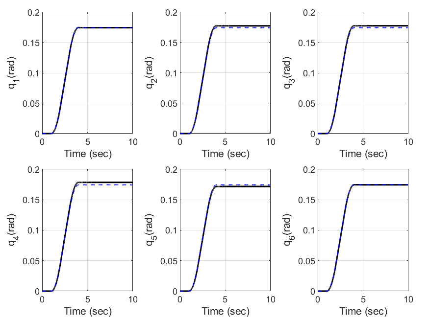
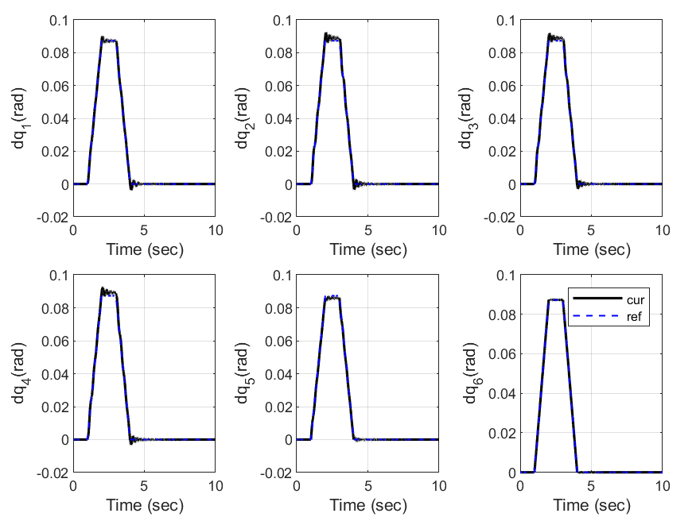
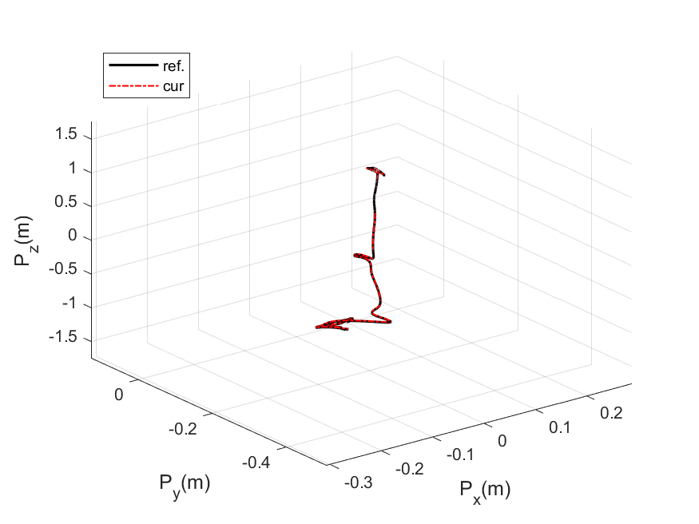
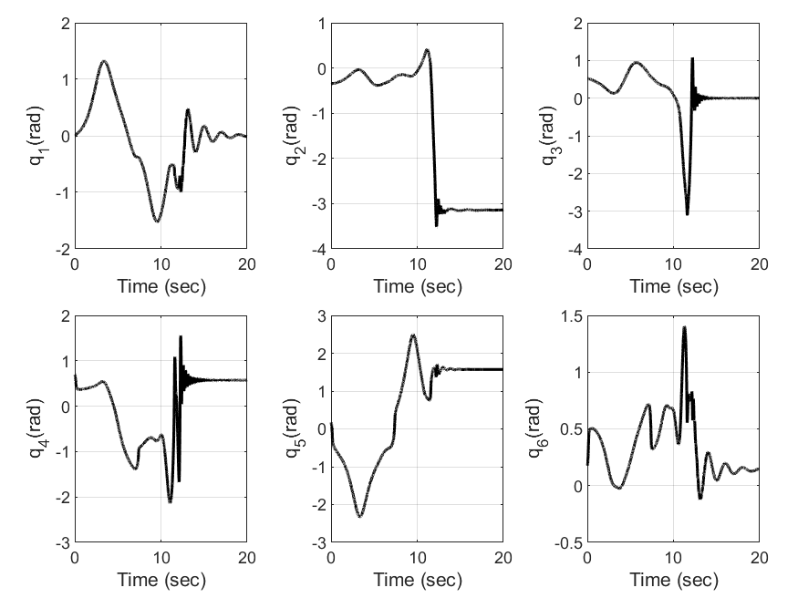
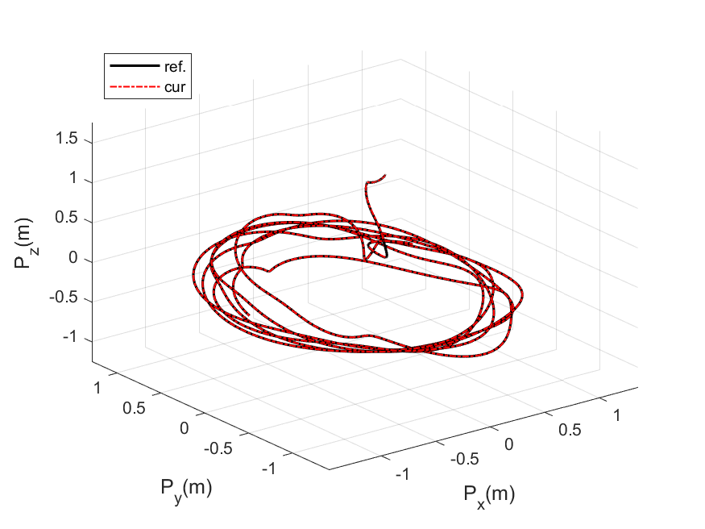
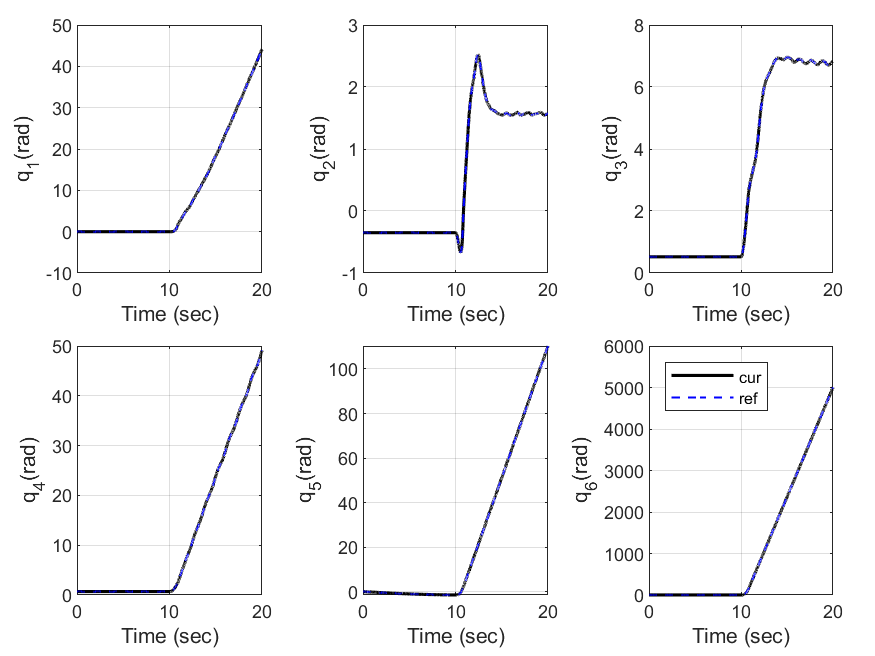
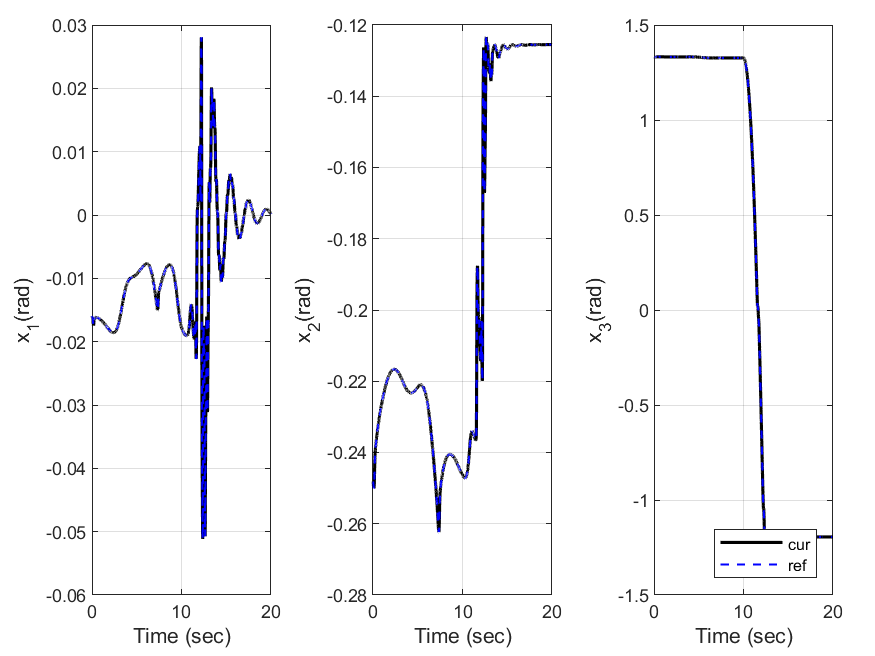

# prototype manipulator matlab simulation

> Authors:	Seonghyeon Jo(cpsc.seonghyeon@gmail.com)
> 
> Date:		 Des, 24, 2021
> 

This repository is a MATLAB simulation of prototype manipulator using RK4(Runge-Kutta 4). The robot manipulator dynamic model (M, C, G) is obtained by Recursive Newton-Euler method. 

### Controller
- fig : controller result figure folder
- model : prototype robot model library folder
  + get_CoriolisMatrix.m : Coriolis matrix function  
  + get_GravityVector.m : Gravity vector function  
  + get_MassMatrix.m : Inertia matrix function  
  + plant.m :  robot manipulator plant function   
  + rk.m :  Runge-Kutta 함수
- 1. main_cartesian_joint_pd_controller.m : cartesian joint pd controller code
- 1. main_cartesian_admittance_controller.m : cartesian admittance controller code
- 1. main_driect_cartesian_pd_controller.m : cartesian pd controller code
- 1. main_joint_admittance_controller.m : joint admittance controller Code
- 1. main_joint_pd_controller.m : simple joint pd controller code
- 
#### joint pd controller

 

#### cartesian pd controller

 

#### cartesian joint pd controller

 

####  joint admittance controller

 
 

#### cartesian admittance controller

 
 

